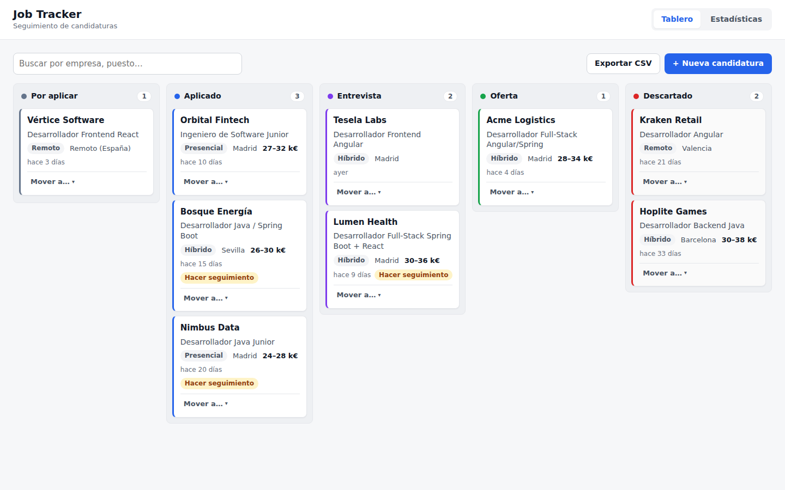
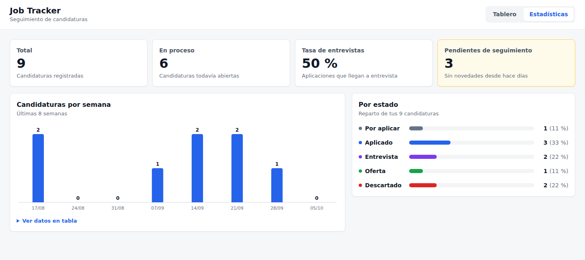

# Job Tracker — seguimiento de candidaturas

Tablero Kanban para llevar el control de las candidaturas de empleo: por aplicar, aplicado, entrevista, oferta y descartado. Guarda el historial de cada proceso, avisa de las candidaturas que necesitan seguimiento y muestra estadísticas semanales.

- **Backend:** Java 17 + Spring Boot 3.5 (Web, Data JPA, Validation) + H2 + springdoc-openapi (`backend/`)
- **Frontend:** React 19 + TypeScript + Vite, sin librerías de UI ni de drag & drop (`frontend/`)

## Capturas





## Arrancar en local

Requisitos: JDK 17+, Maven y Node.js 20.19+ o 22.12+.

```bash
# Backend: http://localhost:8081 (Swagger UI en /swagger-ui.html)
cd backend
mvn spring-boot:run

# Frontend (otra terminal): http://localhost:5173
cd frontend
npm install
npm run dev
```

La primera vez se crea una base de datos H2 en `backend/data/` con 9 candidaturas de ejemplo (empresas ficticias) repartidas por todos los estados, para que el tablero y las estadísticas no estén vacíos.

## Tests

```bash
cd backend && mvn test                 # dominio + tests de la API con MockMvc
cd frontend && npm test && npm run lint
```

## Reglas de negocio

- **Cambios de estado permitidos:** Por aplicar → Aplicado o Descartado · Aplicado → Entrevista o Descartado · Entrevista → Oferta o Descartado · Oferta → Descartado · Descartado → Aplicado (reabrir). Cada cambio queda en el historial.
- Al pasar a **Aplicado** se guarda la fecha de candidatura si no estaba puesta.
- **Seguimiento pendiente:** una candidatura en Aplicado sin novedades en 14 días, o en Entrevista sin novedades en 7.
- **Tasa de entrevistas:** candidaturas que llegaron a entrevista u oferta entre las que llegaron a enviarse.
- El salario mínimo no puede ser mayor que el máximo.

Las reglas viven en clases Java puras (`StatusTransitions`, `StatsCalculator` y los métodos de `JobApplication`), testeadas sin levantar Spring. La fecha actual se inyecta con un `Clock`.

En el frontend, el tablero usa el drag & drop nativo de HTML5 con actualización optimista: la tarjeta se mueve al momento y, si la API rechaza el cambio, vuelve a su sitio y se muestra el motivo. Cada tarjeta tiene también un menú «Mover a…» para usarlo sin ratón.

El botón «Exportar CSV» descarga todas las candidaturas en un CSV separado por `;` y con BOM UTF-8, para que Excel lo abra con las tildes bien y en columnas. Los campos que empiezan por `=`, `+`, `-` o `@` se escapan para evitar inyección de fórmulas.

## API

| Método | Ruta | Descripción |
| --- | --- | --- |
| GET | `/api/applications?status=&q=` | Listado con filtro por estado y búsqueda por empresa o puesto |
| GET | `/api/applications/{id}` | Detalle con historial de estados |
| POST | `/api/applications` | Nueva candidatura |
| PUT | `/api/applications/{id}` | Editar datos |
| PATCH | `/api/applications/{id}/status` | Cambiar de estado |
| DELETE | `/api/applications/{id}` | Borrar |
| GET | `/api/stats` | Totales, reparto por estado, tasa de entrevistas y candidaturas por semana |

Los errores siguen el estándar **ProblemDetail (RFC 9457)**: `400` si los datos no son válidos (con un mapa `errors` por campo), `404` si no existe y `422` si el cambio de estado no está permitido.
